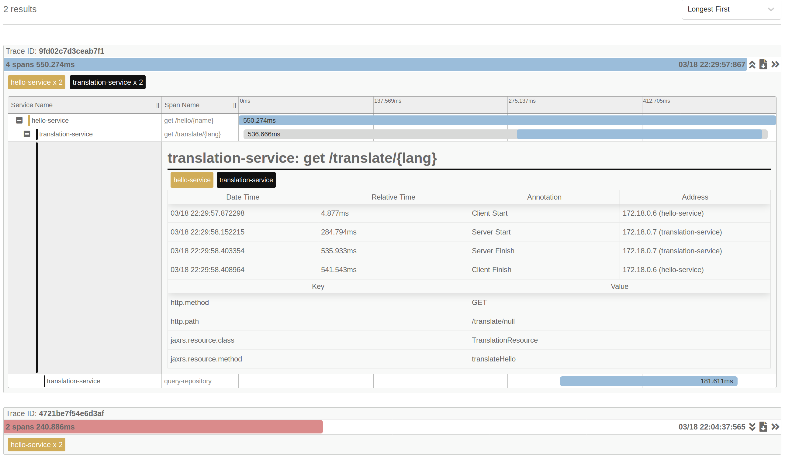
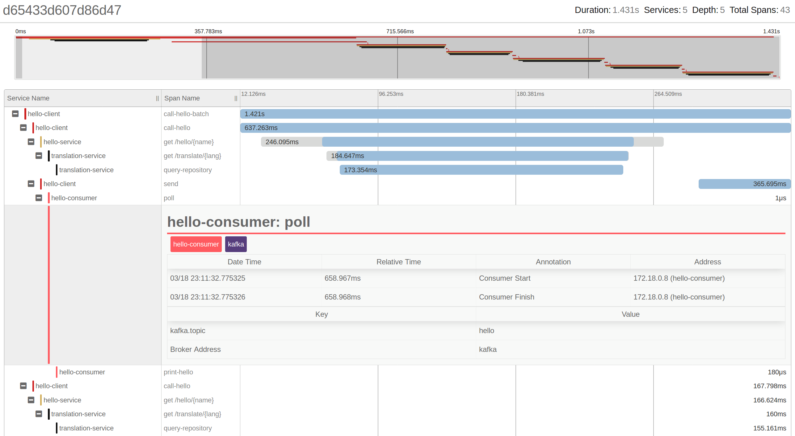

# Talk: Tracing Kafka-based applications with Zipkin

Demo material from talk about tracing Kafka-based applications with Zipkin

Slides: <https://speakerdeck.com/jeqo/the-importance-of-observability-for-kafka-based-applications-with-zipkin>

## Labs

1. Hello world distributed tracing: Understand basics about distributed
   tracing.
2. Tracing Kafka-based apps: Instrumenting Kafka-based applications with
   Zipkin.
3. `Spigo` demo: How to experiment with Zipkin and models built on top of 
Tracing data.

### Pre-requisites

- jdk-8+
- docker-engine, docker-compose

Build applications and starts Docker compose environment: 

```
make
```

## Lab 1: Hello world distributed tracing

This lab will introduce initial concepts about distributed tracing like Span,
Trace and Context Propagation.

### Initial Scenario: Hello World Services

There is a service called Hello World that is capable of say hi in different
languages, by using a Hello Translation service, and return a response to
a user.

```
+--------+   +---------------+   +--------------------+
| Client |-->| Hello Service |-->| Transation Service |
+--------+   +---------------+   +--------------------+
```

An HTTP Client will call the `Hello Service` expecting a greeting. The execution of 
this operation will be traced, and the trace created by this execution is called a
`span`. The Hello Service then will call then the Translation Service, to translate
the "Hello" word according to the request.

As the `Translation Service` is also instrumented to trace the execution of its operations
exposed via HTTP, then the execution of translation operation will create another 
`span`.

For the translation span to be aware that is part of a bigger trace, it should receive
some references of the parent trace. This will come as part of the HTTP Request. 
As the HTTP Client call from `Hello Service` is instrumented with tracing, it will "inject"
the tracing context on the HTTP Headers.

The `Translation Service`, by receiving the trace context as part of the headers, will create 
its spans with reference to that context.

The instrumentation libraries will send the spans created to a tracing system, Zipkin in this case, 
for it to recreate the complete trace from distributed spans. 

#### How to run it

1. Start `hello-service` in one terminal:

```
make hello-service
```

The service by itself is not enough to produce a successful -it requires the translation
service. To know that is working successfully: you have to participate in a transaction
(e.g. make a request), be watching the logs, or produce some evidence from instrumentation. 

If you instrument your service for tracing correctly you will have evidence of each operation.

2. Make a call (that will produce an error):

```
$ curl localhost:18000/hello/service
{"code":500,"message":"There was an error processing your request. It has been logged (ID f0cbd609d1b40741)."}
```

3. Go to Zipkin to check the traces <http://localhost:9411/>:


And check the details:


We have 2 spans: One created by the service operation exposed via HTTP interface, that 
is the root `span` as is the first one of a trace. And there is a second child `span`
that is created by the HTTP Client operation attempting to call the Translation Service.
As this call has failed, the error is recorded as part of the trace and the trace is 
marked as an error trace (i.e. red trace)

A trace can be tagged with related metadata that can facilitate the discovery of traces:



In this case, HTTP Method, HTTP Response Status are added to this trace.

4. If we start the translation service, run in another terminal: 

```
make hello-translation
```

5. Now, try to call the `hello-service` via curl: 

```
$ curl localhost:18000/hello/service
{"hello":"Hello, service","lang":"en"}
```

6. Check that a new trace is recorded, and it has 2 services collaborating: 


And in the trace details, you will see 3 spans, 1 from `hello-service` and 2
from `translation-service`:



The first 2 spans are created by the instrumentation for 
[HTTP Client](https://github.com/openzipkin/brave/tree/master/instrumentation/httpclient) 
and [HTTP Server](https://github.com/openzipkin/brave/tree/master/instrumentation/jersey-server):

But the last one is created by using `brave` library (Zipkin instrumentation library for
Java) directly on your code:

`TranslationResource.java`:

```java
  @GET
  @Path("{lang}")
  @Produces(MediaType.TEXT_PLAIN)
  public Response translateHello(@PathParam("lang") final String lang) {
    /* START CUSTOM INSTRUMENTATION */
    final ScopedSpan span = tracer.startScopedSpan("query-repository");
    span.annotate("started-query");
    span.tag("lang", Optional.ofNullable(lang).orElse(""));
    final String hello = repository.find(lang);
    span.annotate("finished-query");
    span.finish();
    /* END CUSTOM INSTRUMENTATION */
    return Response.ok(hello).build();
  }
```

By using existing libraries instrumentation you will get most of the picture on how 
your service collaborate, but when you need to get details about an specific task part
of your code, then you can add "custom" `spans`, so your debugging is more specific.

### Scenario 02: Hello World Events

Instead of a web client, a Client application with implement a batch process 
to call Hello Service and produce events into a Kafka Topic.


```
+--------+   +---------------+   +------------------+
|        |-->| Hello Service |-->| Hello Transation |
|        |   +---------------+   +------------------+
| Hello* |
| Client |   +--------+   +-----------------+
|        |-->| Kafka* |-->| Hello Consumer* |
+--------+   +--------+   +-----------------+
```

> (*) new components

This scenario represents how to propagate context when you are not communicating 
services directly by via messaging. In this case, we will use Kafka as an intermediate
component to publish events.

#### How to run it

1. Start the `hello-client`:

```
make hello-client
```

This will run the batch process to call `hello-service` 6 times in sequence.

It will take around 15 secs. to execute.

As this component is starting the trace, then `hello-service` and `hello-translation`
spans will become children of this parent span:


The messaging broker is defined as an external library here, as part of the `kafka-clients`
instrumentation, so we can have it as part of the picture.

> Interesting finding: first send operation by `kafka-client` Producer, is slower than the others.

2. Now, let's start the consumer to see how its executions will become part of the trace:

```
make hello-consumer
```


> Benefit: Now we have evidence about how much time is taking for data to get downstream. 
For instance, is the goal of adopting Kafka is to reduce latency on your data pipelines, here 
is the evidence of how much latency you are saving, or not.

In the case of Kafka Producers and Consumers, the instrumentation provided by Brave is 
injecting the trace context on the Kafka Headers, so the consumers spans can reference to 
the parent span.

## Lab 02: Twitter Kafka-based application

Data-flow view

```
+---------+   +-------------------+          +------------------+    +--------------+
| Twitter |-->| Twitter Connector |-(Kafka)->| Stream Transform |-+->| DB Connector |
+---------+   +-------------------+          +------------------+ |  +--------------+
                                                               (kafka)
                                                                  |  +--------------+
                                                                  +->| Consumer App |
                                                                     +--------------+
```

Choreography view:

```
                  Kafka
               +----------+
+---------+    |          |    +------------------+
| Twitter |--->|          |--->|                  |
+---------+    |          |    | Stream Transform |
               |          |<---|                  |
               |          |    +------------------+
               |          |
               |          |    +--------------+    +------------+
               |          |--->| DB Connector |--->| Postgresql |
               |          |    +--------------+    +------------+
               |          |
               |          |    +--------------+    +---------+
               |          |--->| Consumer App |--->| Console |
               |          |    +--------------+    +---------+
               +----------+
```

### Instrumentation

- Kafka Clients (Producer/Consumer): <https://github.com/openzipkin/brave/tree/master/instrumentation/kafka-clients>
- Kafka Streams (WIP): <https://github.com/openzipkin/brave/tree/master/instrumentation/kafka-streams>
- Kafka Interceptors for Kafka Connect, REST Proxy, etc (WIP): <https://github.com/sysco-middleware/kafka-interceptors/tree/master/zipkin> 

### How to run it

//TODO

## Lab 3: Spigo Simulation

### How to run it

Clone Spigo project: 

```
git clone git@github.com:jeqo/spigo
cd spigo
```

Visualize architectures on `json_arch/` dir and with UI:

```
cd ui
npm run dev
```

Go to <http://localhost:8000>

Run Spigo to generate traces:

```
spigo -c -d 5 -a netflix
```

Export traces to Zipkin:

```
misc/zipkin.sh netflix
```

Visualize traces on [Zipkin](http://localhost:9411)

Generate Vizceral JSON from Architecture:

```
git checkout git@github.com:jeqo/go-vizceral
cd go-vizceral/arch2vizceral
cp <arch json> arch_json/.
./arch2vizceral -arch netflix > netflix_vizceral.json
```

Copy Vizceral JSON to Vizceral example project and run example:

```
git checkout git@github.com:jeqo/vizceral-example
cd vizceral-example
npm run dev
```

Go to <http://localhost:8080>
